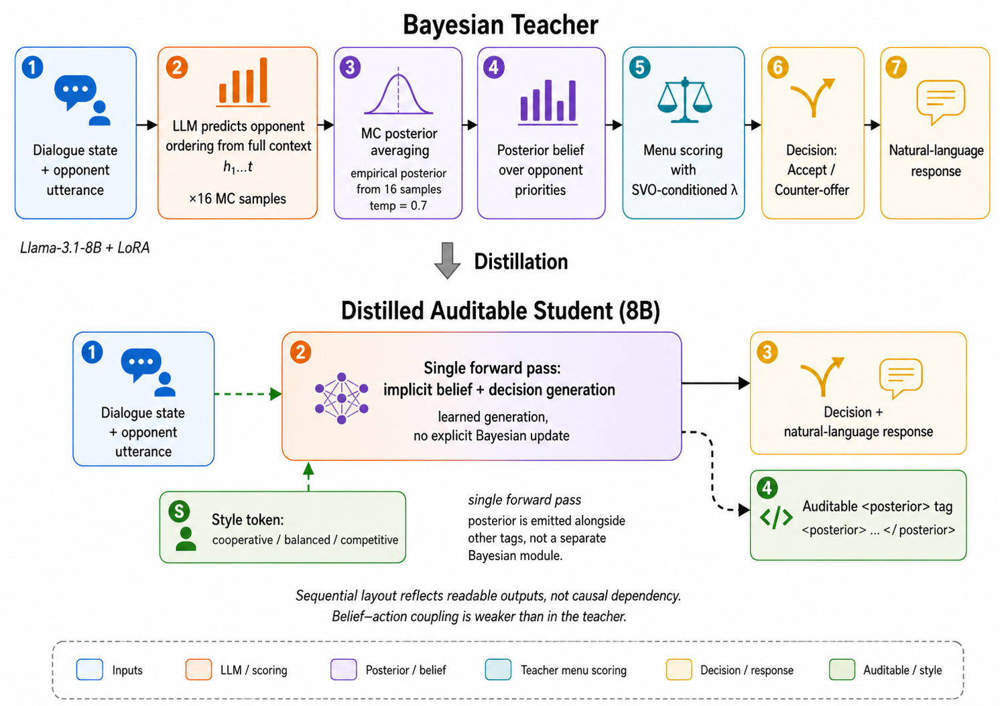
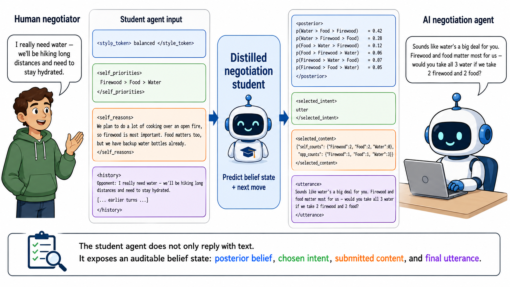

# CaSiNo Belief-State Negotiation

Code and paper artifacts for **Distilling Bayesian Belief States into Language
Models for Auditable Negotiation**. The project studies negotiation agents that
do more than produce a final utterance: they expose an auditable belief state
over the opponent's hidden preferences while deciding whether to accept,
counter-offer, or continue the dialogue.

The core idea is to train a compact student model to imitate the useful
interface of a Bayesian teacher. The teacher explicitly maintains a posterior
over the six possible CaSiNo opponent preference orderings; the student learns
to emit tagged outputs containing a posterior, intent, selected content, and
natural-language response in one forward pass.

## Method Overview



The Bayesian teacher uses Monte Carlo posterior averaging, explicit menu
scoring, and an SVO-conditioned opponent-utility weight. The distilled student
keeps the same auditable interface but replaces the explicit Bayesian update
with learned generation.



During negotiation, the student consumes style, self-priorities, reasoning, and
dialogue history, then emits four inspectable blocks: posterior belief,
selected intent, selected content, and final utterance.

## Main Results

- The balanced distilled student reaches mean Brier `0.114`, below the CaSiNo
  six-ordering uniform reference `5/36 ~= 0.139`.
- The Bayesian teacher reaches Brier `0.085` and serves as the explicit
  posterior-and-menu-scoring reference.
- A 70B structured-CoT baseline has strong action quality but does not natively
  expose a posterior; eliciting a self-consistency posterior gives Brier
  `0.194`.
- The Brier trajectory figure now includes 95% bootstrap confidence bands
  resampled over held-out dialogues, not individual turns.

Paper-facing figures, tables, and provenance live under
[`paper_artifacts/`](paper_artifacts/). The manifest
[`paper_artifacts/manifest.yml`](paper_artifacts/manifest.yml) is the source of
truth for how each paper claim maps to code, data, and saved results.

## Repository Layout

| Path | Purpose |
|---|---|
| `src/casino_belief/` | Active Python package organized by belief inference, policy/menu scoring, student modeling, training, evaluation, baselines, diagnostics, transfer, and LLM utilities. |
| `experiments/lsf/` | Batch launchers for training, evaluation, ablations, DND transfer, and structured-CoT baselines. |
| `data/casino/` | Local CaSiNo splits and quality-filtered subsets. Large JSON files may be ignored for GitHub depending on release policy. |
| `data/dnd/` | Local Deal-or-No-Deal transfer data and derived statistics. |
| `artifacts/` | Generated results, figures, tables, logs, and training metadata. |
| `paper_artifacts/` | Reviewer-facing overlay with paper-numbered figures/tables, claims, method notes, and manifest-first provenance. |
| `tests/` | Unit tests for parsers, bid extraction, DND transfer, auditability, ablations, and data builders. |

## Setup

Create the conda environment and install the package in editable mode:

```bash
conda env create -f environment.yml
conda activate casino
pip install -e .
```

Run the unit tests:

```bash
python -m unittest discover -s tests -v
```

Validate the paper artifact overlay:

```bash
python scripts/check_paper_artifacts_manifest.py
find -L paper_artifacts -type l -print
```

The symlink check should print nothing.

## Core Evaluation

The main turn-level evaluation entry point is:

```bash
python -m casino_belief.evaluation.turn_eval_run \
  --data data/casino/casino_test.json \
  --output-dir artifacts/results/protocol3/turn_eval_smoke_uniform \
  --max-dialogues 5 \
  --agent uniform \
  --annotations external/casino_original/data/casino_ann.json
```

Important agents:

| Agent | Description |
|---|---|
| `bayesian` | Bayesian teacher with posterior, menu scoring, and template utterance. |
| `distilled_student` | LoRA student that emits posterior, intent, selected content, and utterance tags. |
| `structured_cot_live` | Live 70B structured-CoT baseline under Protocol 3. |
| `structured_cot_replay` | Replay adapter for saved structured-CoT traces. |
| `uniform` / `hybrid` / `sft` | Baselines and intermediate opponent-model variants. |

## Reproducing Paper Artifacts

Headline posterior-quality artifacts:

```bash
python -m casino_belief.diagnostics.posterior_quality.make_headline_artifacts
```

Bayesian teacher Protocol 3 run:

```bash
bash experiments/lsf/evaluation/run_bayesian_protocol3.lsf
```

Student Protocol 3 run:

```bash
bash experiments/lsf/evaluation/run_day9_student_eval.lsf
```

Distillation data and student training:

```bash
bash experiments/lsf/training/run_distill_data.lsf
bash experiments/lsf/training/run_day8_sft_train.lsf
```

The student parser lives in
[`src/casino_belief/student/student_parser.py`](src/casino_belief/student/student_parser.py);
free-text bid extraction lives in
[`src/casino_belief/evaluation/bid_extractor.py`](src/casino_belief/evaluation/bid_extractor.py).

## Notes

- Keep paper claims tied to `paper_artifacts/manifest.yml` entries and visible
  denominators.
- Large checkpoints, caches, and generated intermediate files should not be
  committed unless they are explicitly part of a release artifact.
- External datasets and model families remain subject to their original
  licenses and access terms; see [`ASSET_LICENSES.md`](ASSET_LICENSES.md) and
  [`NOTICE`](NOTICE).
